# 2020建模国赛B题

问题：2020建模国赛B题沙漠游戏

作者：[王子路](https://github.com/Prinway)、[羊山](https://github.com/seanys)、[李玏晨](https://github.com/lilechen)

单位：同济大学经济与管理学院-管理科学与工程系

获奖：全国一等奖

## 目录

- [问题介绍]($经验介绍)
  - [资源配置问题求解 ](#资源配置问题求解)
    - 问题介绍
    - 求解思路
  - [最优决策问题求解](#最优决策问题求解)
    - 问题介绍
    - 求解思路
  - [动态博弈问题](#动态博弈问题)
    - 问题介绍
    - 求解思路
- [经验介绍]($经验介绍)
- [论文](#论文)
- [问题](#问题)

## 资源配置问题

### 问题介绍

一二关比较类似，均为单个玩家在天气确定的情况下进行决策，存在最佳的策略，将模型进行简化后，我们可以建立状态转移方程，通过动态规划求解最佳策略。

### 求解思路

建立状态转移方程和阶段损益函数，即可进行动态规划求解。

由于在起点处(第 0 天)存在不同的物资补给策略，这些策略会影响初始状态，进 而影响游戏过程中的决策序列和最终结果。因此，使用多重搜索算法分别考虑第 0 天水和食物的补给，对第 0 天的所有补给策略进行搜索，每种补给策略对应一个初始状态。 确定初始状态后，使用动态规划模型计算出每种初始状态所对应的最优策略。最后，从 所有初始状态所对应的最优策略中选出最优策略，即为关卡的全局最优策略。

在有村庄的地图中，村庄补给的策略过多大大增加了计算复杂度。因此，采用“先使用后记账”的策略对算法进行优化:允许资源存在缺口，每次经过村庄或到达终点时， 若资源存在缺口，则检查缺口是否可在上一次经过村庄时得到满足。若可以满足，则补上缺口，扣除资金，保证了补给的最低限度；若无法满足（超过负重或上次经过村庄时资金不足），则进行剪枝，停止此状态的继续递推。此外，考虑到模型的求解方向和状态转移函数的方向均为正向，求解过程中结合了记忆化搜索算法对经典动态规划算法加以改进。 

## 最优决策问题

### 问题介绍

第三四关均为不确定决策问题，由于天气全部都不确定，这就导致决策问题比较复杂。我们需要将决策路径进行简化，对不同天气选择不同策略的收益进行分析，最后做出决策。

### 求解过程

首先建立整个的决策过程和约束方程。玩家一共有几个选项，选择直接前往终点，或者前往矿山/村庄后再前往终点；在整个过程中，需要满足确定的约束方程。

基于上述决策过程，对各个决策分析终止条件、挖矿条件等进行分析，我们可以发现在初始点购买的食物和水去挖矿是能够获得收益的，而在村庄购买的物资挖矿收益为负。同时进一步考虑到初始的购买，需要最大化最终能够挖矿的天数，但是由于天气的不确定性，可能会造成水和食物的失衡，但是通过计算可以得到，不管如何失衡，再去村庄买资源重新挖矿都是不划算的，最终可以获得以下结果：

第三关类似，按照某个购买策略，在天气全部是晴天时，恰好能够多挖一次矿，最优答案唯一。

## 动态博弈问题

### 问题介绍

第五关第六关均为多玩家参加问题，第五关的天气确定，第六关的天气不确定。而该问题的复杂性在于，玩家之间无法沟通，存在博弈关系，决策如果相同，会造成综合收益低，考虑到现实的博弈过程中，玩家都是有风险鹏好的，所以我们可以对玩家的风险倾向进行定义，再通过马尔可夫状态转移过程及蒙特卡洛模拟进行仿真，从而获得最终的分析。

### 求解过程

设定风险偏好，建立不同风险偏好的状态转移方程，如下

使用蒙特卡洛模拟方法构建仿真程序，模拟不同风险接受程度的玩家的马尔可夫决策过程，进而探究风险接受程度的高低对玩家做出决策优劣的影响。 

每一次模拟中，所有玩家除风险接受程度(状态转移概率)外的的初始条件完全相同，每位玩家的风险接受程度由程序随机指定。每一阶段，玩家考虑其他玩家的可能行动方向与自身从当前位置到终点的最优子策略是否存在冲突，若冲突则依据风险接受程度做出前往冲突点或绕路的决策。仿真过程中最优子策略的求解方法与问题一中的动态 规划求解方法相同。每一次模拟结束后，记录每位玩家的决策路径、最终剩余资金。若玩家由于资源或资金不足导致未能到达终点(游戏失败)，则最终剩余资金为0。 

对仿真结果进行分析，最终剩余资金最多的玩家中，同时也是当局游戏三位玩家中 风险接受程度最高的玩家的比例约为 40%(占比最高)，这些玩家中，多数都是风险偏 好者和风险厌恶者。然而，仿真结果也显示，过高的风险接受程度带来的过多冲突将消 耗过多资源，导致游戏失败。为了探究合适的风险接受程度，对所有游戏失败玩家的风险接受程度进行统计，可绘制直方图并进行核密度估计，结果如图14所示。 

## 经验总结

**组队情况**：全员大四年级

**赛前准备**：三个同学参赛经验不足，没有提前准备或者看过任何资料。但是有一些先修课程比如决策模拟、算法分析设计、运筹学、博弈论、优化方法等，课上做过一些Project，外加做过一些资源优化和决策问题的Project，看过很多该方面资料，小组两位同学都基本准备直博，做过一年时间的运筹方向科研

**选题方面**：当晚看到题目之后，C题门槛太低，A题不太熟悉，B题完全就在我们的擅长的领域上，简单讨论后果断选择B题

**论文编辑**：建议采用Latex的模板进行编辑，可以在github检索当年是否有最新的模板，比如[latexstudio/CUMCMThesis](https://github.com/latexstudio/CUMCMThesis)，然后采用github云端私有仓库的方式，协同合作，各自完成修改同步到云端即可

**时间安排**：我们的时间安排比较从容，周四没做什么，第一二问周五开始做周六中午基本上做完了，也没熬夜，其中微信和Zoom沟通了一下新的发现和进度，第三问遇到了一些问题，大概周日中午做完了，周日中午下午也补充修改了第二问，然后周日下午搞定之后就提交了

**总结**：就我们队比赛的经验来看，因为这个国一是拿的还算比较轻松的，也没怎么熬夜和查资料，虽然坦白来说我们做的也不算那么满意，本质上数学建模比赛是使用数学工具解决现实问题，所以理论上来说，有比较好的通过代码、数据处理和建模解决遇到的数学问题的能力是最重要的，获奖应该只是水到渠成

## 论文

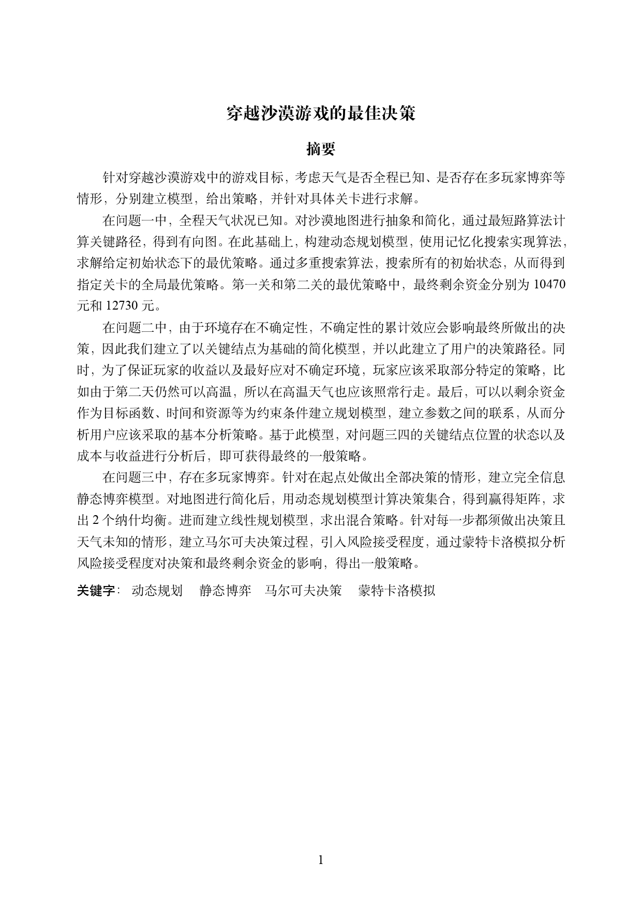

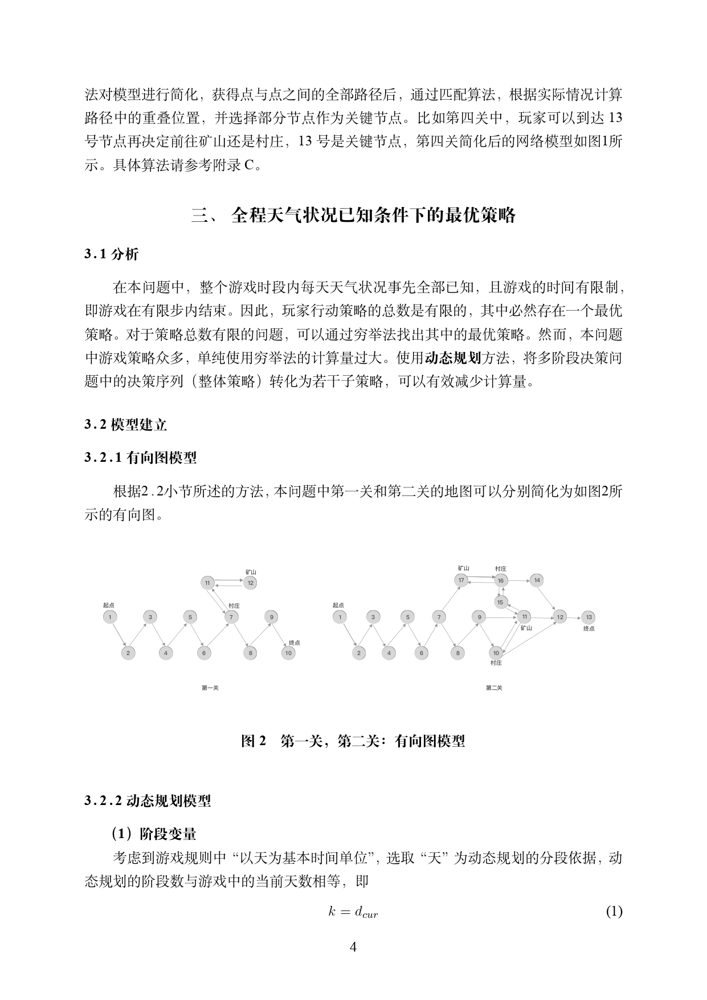

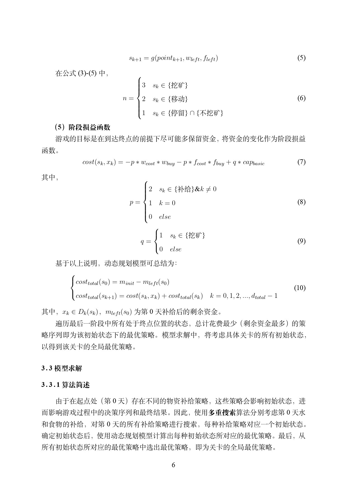

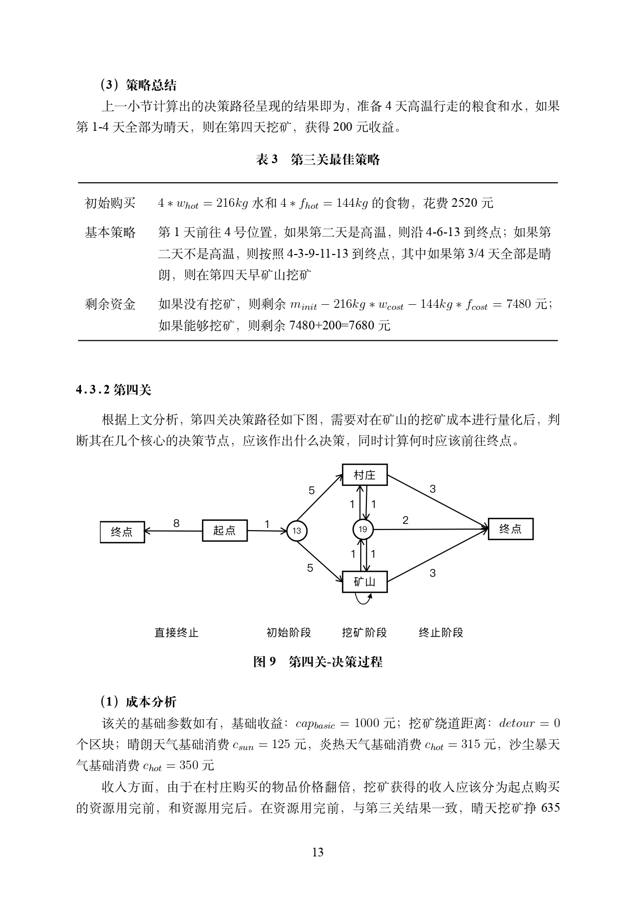

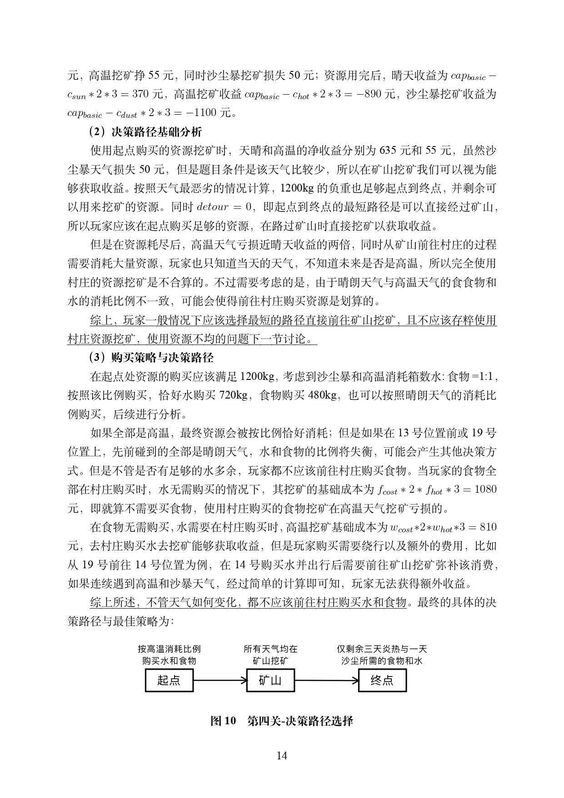

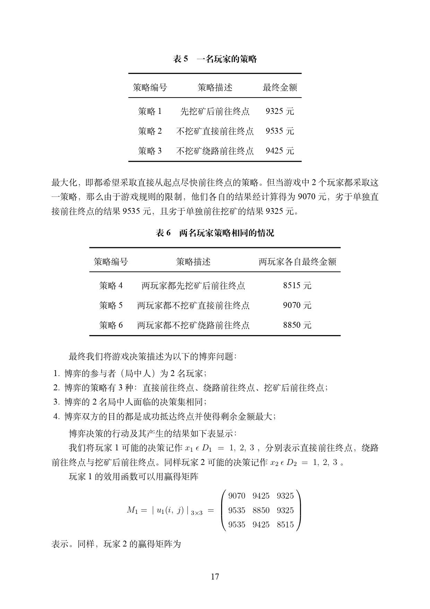

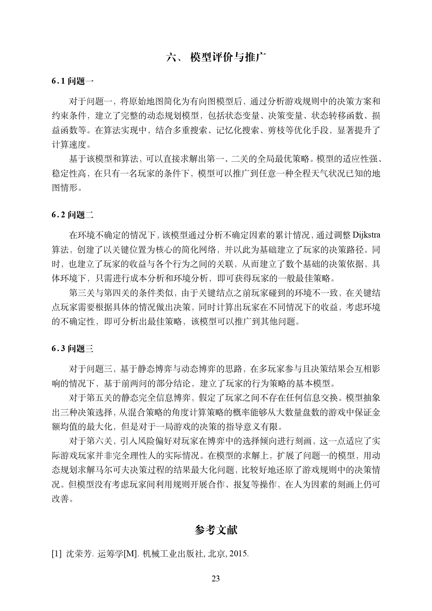

## 问题

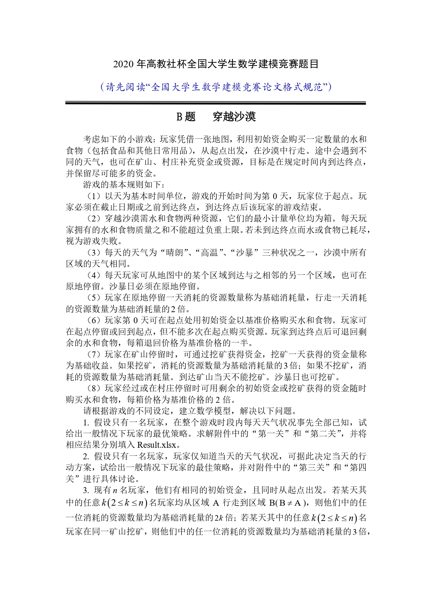

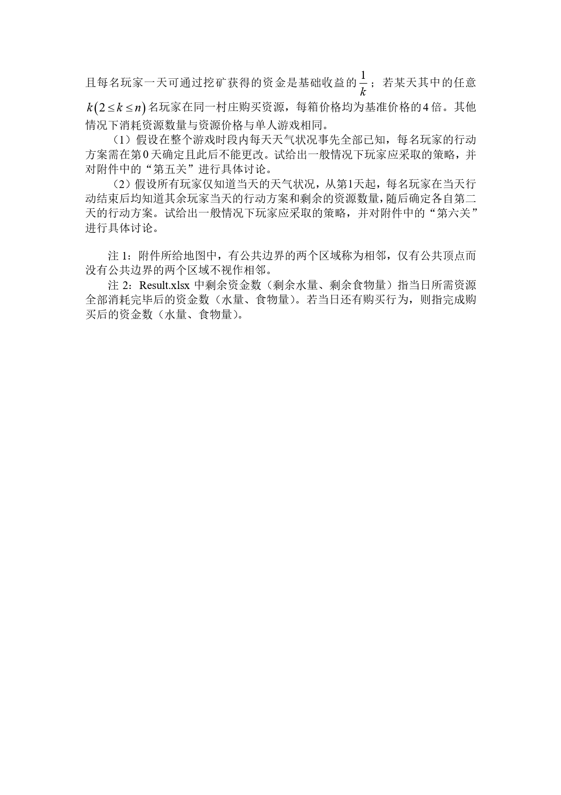

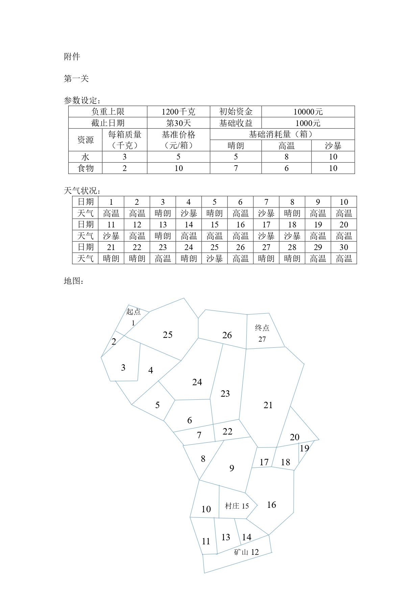

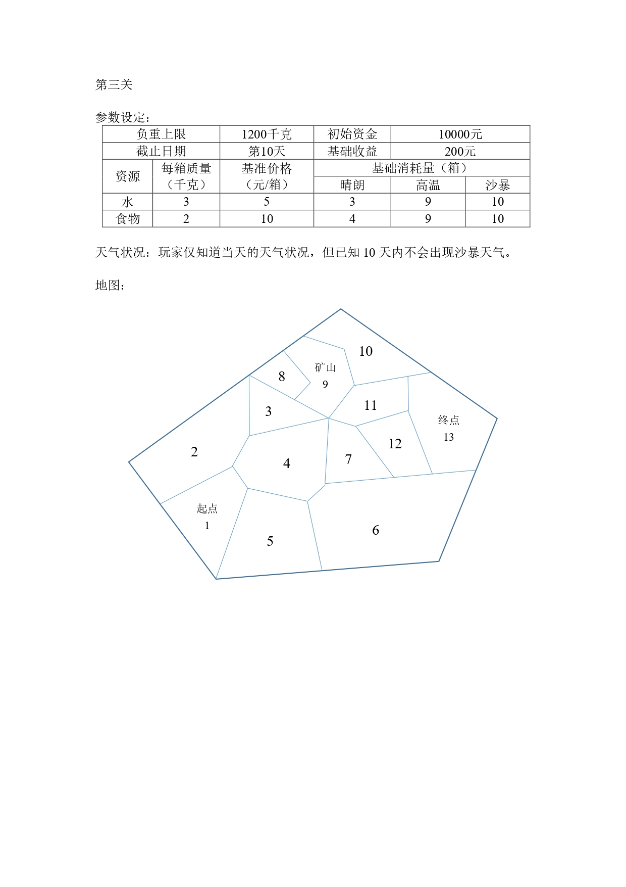

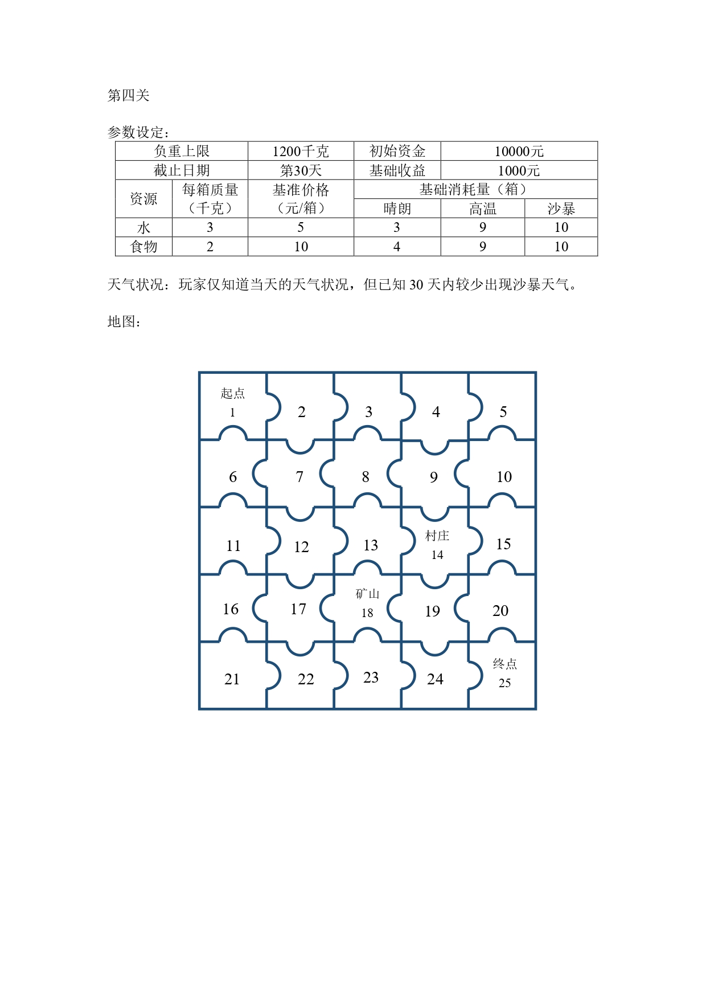

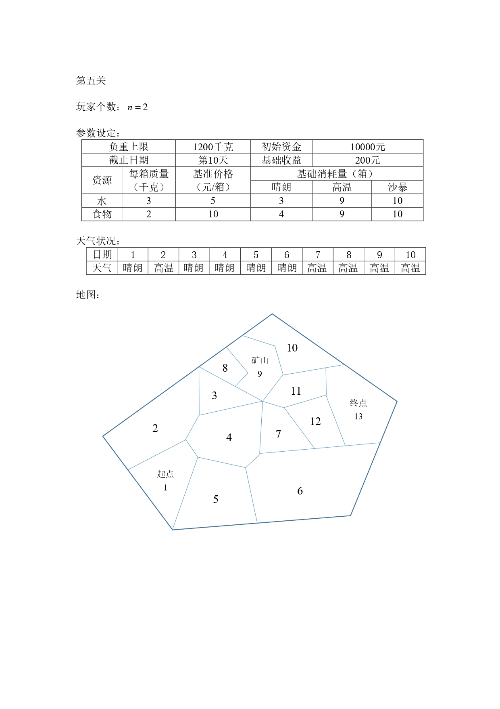

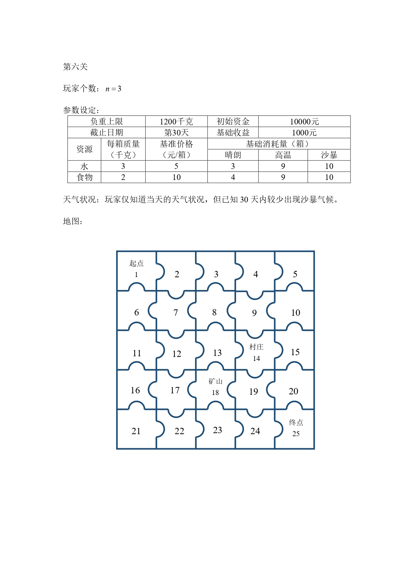